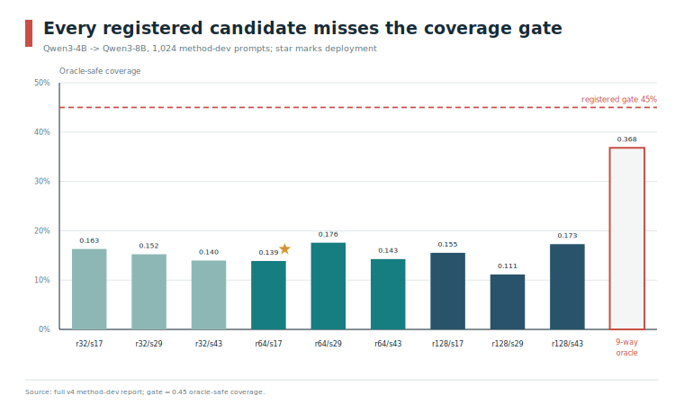

# GoldenExperience

[English](README.md) | [中文](README.zh-CN.md)

GoldenExperience 是一个 artifact-first 的跨模型 KV Cache 转换研究框架，运行底座为
**vLLM + LMCache MP + Mooncake Store**。

> **当前研究状态：** publication v5 得到的是终止性的负结果，不是已获批的部署系统。
> Qwen3-4B 到 Qwen3-8B 的注册 v4 transport 已完成训练，但 method-dev 安全门失败。
> selector、calibration、其他方向、validation、semantic sealed 评估以及跨模型 runtime audit
> 均被协议阻断。

[完整论文](paper/paper.md) | [证据包](artifacts/publication_v5/evidence/README.md) |
[图表与绘图数据](artifacts/publication_v5/figures/README.md) |
[Pipeline 合同](docs/v5_pipeline.md) | [相关工作与 claim 审计](docs/related_work_matrix.md)

## 核心结果

九个注册候选由 rank 32/64/128 与 seed 17/29/43 的笛卡尔积组成，在 4,096 条训练样本上
训练三个 epoch。冻结的 rank 聚合规则选择 rank 64，部署 identity 固定为 seed 17。

| 指标 | 注册结果 | 要求 |
| --- | ---: | ---: |
| Task preservation | 0.976862 | 仅报告，不能单独作为安全结论 |
| 16-token greedy agreement | 0.617249 | 每条 safe prompt 至少 0.98 |
| Aggregate perplexity drift | 21.47% | 每条 safe prompt 至多 2% |
| Oracle-safe prompts | 142 / 1,024 | - |
| Oracle-safe coverage | **0.138672** | **至少 0.45** |
| 全九候选事后 oracle | 377 / 1,024 = 0.368164 | 仍低于 0.45 |

Full-prefix supervision 确实改善了目标机制：固定 rank 128/seed 17 后，safe count 从 115
提高到 159，其中 8,192-token bucket 净增加 24 条。但固定低秩 affine operator 仍不能在不同
任务间稳定保持 decoded behavior。



完整 method-dev 报告含 9,216 条 measurement；未压缩报告 SHA-256 为
`f35e9599cea4d56cb1d0a7fad888a7d1bf2cef2602c9f42950162de7662a4400`。

## 已实现内容

GoldenExperience 不替代推理引擎或缓存存储，只在现有服务组件周围增加狭窄的控制平面与
证据平面：

- **跨模型规划：** model identity、KV topology、prefix binding、策略选择，以及
  base/LoRA、尺度变体和探索性跨 base 场景的 fail-closed fallback。
- **Head-aware transport：** RoPE-aware 的 layer/head mixing、独立低秩 affine K/V map、
  train-only normalizer 与 ridge/SVD 初始化。
- **可复现训练：** grouped full-prefix supervision、确定性 rank/seed screening、包含完整
  AdamW 状态的原子 checkpoint，以及可独立 replay 的 method-dev report。
- **证据 pipeline：** 内容绑定的数据/模型/代码 identity、split 隔离 collection、artifact
  authority state、one-shot sealed guard，以及真正执行 stop rule 的 stage dependency。
- **选择性准入协议：** source-only sidecar、冻结 risk predictor、exact calibration bound、
  validation 和 selector baseline。这些实现有测试，但当前 workspace 在 method-dev 失败后
  没有执行它们。
- **运行时集成：** LMCache MP secondary lookup、直接原子 scatter 到 vLLM paged KV、失败
  rollback，以及不发布 translated target object。当前没有获批的 v4 真实模型 runtime 结果。

实现能力与经验性 authority 明确分离：

| Stage | 当前状态 | 仓库可以支持的主张 |
| --- | --- | --- |
| Transport collection 与 fit | 已完成 | 精确 fitted candidates 与 provenance |
| Method development | **失败** | 终止性负结果与 mechanism diagnostic |
| 其他方向 fit | 被阻断 | 仅有实现 |
| Selector 与 calibration | 被阻断 | 仅有经过测试的协议 |
| Validation | 被阻断 | 不存在 `validation_candidate` |
| Semantic sealed | **locked** | payload 未打开，没有 final-test estimate |
| Runtime audit | 被阻断 | 没有 accepted-reuse 或跨模型 TTFT 主张 |

## 复现论文证据

论文工具只依赖 Python 标准库，不需要也不会访问 sealed payload。

```bash
# 干净 clone 可直接从 tracked deterministic report archive 检查。
python3 paper/tools/build_method_dev_evidence.py --check --from-archive

# 在内存中重建所有 CSV/SVG/PDF，并逐字节对照 tracked 文件。
python3 paper/tools/build_figures.py --check

# 检查 claim、数值、引用、链接、hash 与 locked workspace receipt。
python3 paper/tools/check_manuscript.py
```

所有生成器都会拒绝 input/output path 中含有 `sealed` 的路径。证据 archive 解压后与原始
8,043,391-byte report 完全一致；每张图均保留 CSV、accessible SVG 和 deterministic vector
PDF。

## 安装与测试

创建 Python 3.10+ 环境：

```bash
python3 -m venv .venv
source .venv/bin/activate
python3 -m pip install -e ".[dev]"
```

运行工程检查：

```bash
pytest
ruff check goldenexperience tests scripts paper/tools
mypy goldenexperience
python3 -m build
```

运行 planner 示例：

```bash
python3 scripts/smoke_cross_model_plan.py
```

该输出只演示 control-plane 行为，不会创建 publication-v5 approved artifact。

## 架构

```text
client -> vLLM OpenAI-compatible server
             |
             | LMCacheMPConnector
             v
      standalone LMCache MP server
             |
             | L2 adapter: type=mooncake_store
             v
      Mooncake Store on local TCP + SSD
             |
             | source lookup + sidecar gate + transform
             v
      GoldenExperience direct paged-KV materializer
             |
             +-- success: 原子发布所有 translated layers
             +-- failure: 使 partial blocks 失效并执行 native prefill
```

运行时职责保持狭窄：

- vLLM 负责模型加载、调度、解码与推理正确性。
- LMCache MP 负责共享 KV 查询、卸载、淘汰和预取编排。
- Mooncake Store 负责跨 engine 重启持久化的 L2 metadata 与 objects。
- GoldenExperience 负责跨模型 identity、planning、translation、admission metadata、
  materialization 与 fallback accounting。

## 仓库结构

```text
goldenexperience/
  benchmarks/       冻结 benchmark builder 与确定性 scorer。
  cli/              Console entry points，包括 publication-v5 pipeline。
  lmcache_patch/    Patch manifest 与 LMCache sidecar metadata。
  reuse/            ModelRef、KVShape、request、plan 与 scenario planner。
  runtime/          vLLM/LMCache/Mooncake 检查、adapter 与 baseline orchestration。
  size_variant/     Transport、fit、risk、validation、sealed 与 runtime contract。
artifacts/
  publication_v5/  Receipt、负结果证据、CSV/SVG/PDF 图表与 diagnostic。
  kv_baseline/      精选同模型底座 manifest；raw run 被 Git 忽略。
configs/            Runtime 示例与冻结的 publication source identity。
docs/               方法预注册、pipeline、数据、设计与 claim boundary。
paper/              完整论文、参考文献、复现和审计工具。
recipes/            可 source 的 runtime environment overlay。
scripts/            薄 operational/diagnostic launcher。
tests/              Unit 与 integration tests。
```

## Publication-v5 协议

冻结 benchmark 将训练、方法开发、选择器、校准、验证、最终语义评估与运行时测量分开：

| Split | 行数 | 当前访问状态 |
| --- | ---: | --- |
| `transport_train` | 4,096 | 已用于注册 fit |
| `method_dev` | 1,024 | 已使用；终止门失败 |
| `selector_train` | 2,048 | 被阻断 |
| `risk_calibration` | 2,048 | 被阻断 |
| `validation` | 2,048 | 被阻断 |
| `semantic_sealed_test` | 2,048 | locked 且未打开 |
| `runtime_audit` | 512 | 被阻断 |

Method-dev 已经为 v2、v3、v4 提供设计反馈，不能再作为下一种 adaptive method 的独立
confirmation set。未来的成功主张必须绑定新代码、新 workspace 和新冻结的 development split；
不能打开当前 validation 或 semantic payload 来继续调方法。

## 同模型服务底座

仓库保留真实的同模型 offload/reuse baseline，用于独立验证 vLLM、LMCache MP 和 Mooncake，
而不是证明跨模型质量。安装 pinned runtime stack：

```bash
./scripts/install_runtime.sh --mode package
```

启动同模型 baseline：

```bash
source recipes/kv_baseline_mooncake_local.env
GE_MODEL_PATH=Qwen/Qwen3-8B \
GE_PORT=30000 \
scripts/kv_baseline/run_vllm_lmcache_mooncake_kv_baseline.sh -- --tensor-parallel-size 1
```

Raw run 位于 `artifacts/kv_baseline/<run_id>/` 并被 Git 忽略；只应在
`artifacts/kv_baseline/manifests/` 保留精选 manifest。同模型 baseline 成功只能说明存储底座
工作正常，不能证明 v4 跨模型转换安全或更快。

需要修改上游组件时才使用 source mode：

```bash
./scripts/install_runtime.sh --mode source
```

已验证的 package-mode 组合为 CUDA 13、`vllm==0.24.0`、`lmcache==0.4.6`。修改 CUDA、
Python 或上游 revision 前，请先阅读 runtime scripts 与 `docs/shared_kv_substrate.md`。

## Artifact Authority 与安全边界

Runtime loader 由 state gate 控制：

| Artifact state | 离线使用 | 打开 sealed split | 自动跨模型复用 |
| --- | --- | --- | --- |
| `validation_candidate` | 可以 | 不可以 | 不可以 |
| `semantic_approved` | 可以 | 已 one-shot 完成 | 不可以 |
| `approved` | 可以 | 已 one-shot 完成 | 可以 |

Publication v5 当前不存在上述任何一种 artifact。任何缺失、损坏、identity 不匹配、未校准或
未获批的 artifact 都必须回退到 native target prefill。

不要检查、抽样、hash 或改作他用 semantic payload。只有 dedicated one-shot opener 能读取它，
且前提是四个注册方向全部通过 validation。当前 workspace 不满足该前提。

## 引用

引用元数据见 [CITATION.cff](CITATION.cff)。首选引用是负结果论文
**“Can KV Caches Cross Model Scales? A Fail-Closed Evaluation of Qwen3 Prefix Translation.”**
请勿把当前版本引用为已获批跨模型 serving speedup 的证据。

## 许可证

GoldenExperience 使用 [Apache-2.0 license](LICENSE)。数据集再分发还需遵守
`configs/publication_sources.qwen3-v5.json` 中记录的上游许可证。
