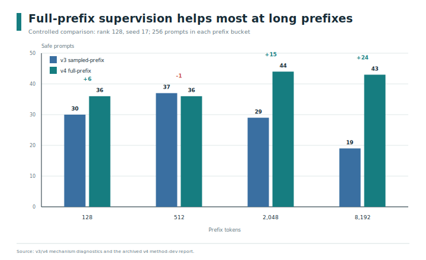
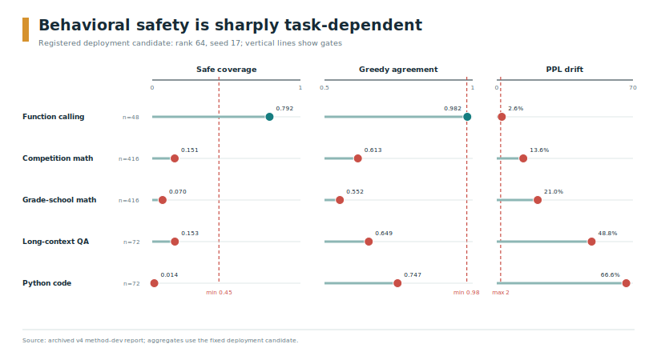
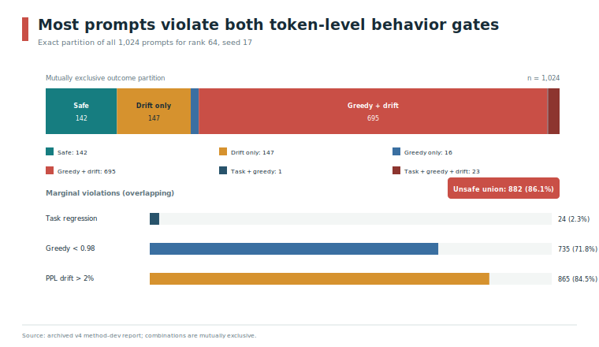
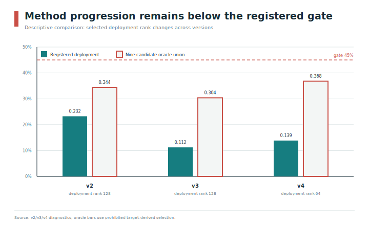
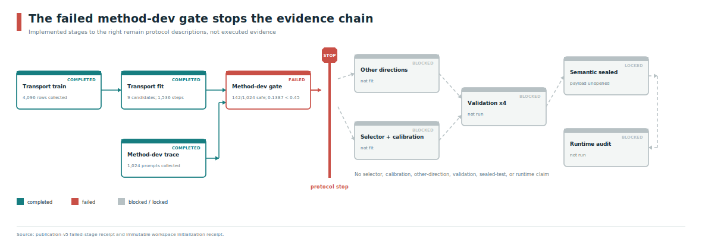

# Can KV Caches Cross Model Scales?

## A Fail-Closed Evaluation of Qwen3 Prefix Translation

**Manuscript status.** Artifact-backed preprint draft. This is a negative-results paper, not a
deployment-success report. The registered Qwen3-4B to Qwen3-8B transport fit completed, but its
independent method-development gate failed. Consequently, this workspace contains no approved
selector, calibration, other-direction fit, validation, semantic-sealed evaluation, or cross-model
runtime result.

## Abstract

Cross-model key-value (KV) cache translation could remove target-model prefix prefill, but tensor
similarity and average task scores do not establish that a translated cache preserves decoded
behavior. We build an auditable, fail-closed evaluation stack for cross-scale Qwen3 prefix
replacement. It binds model, tokenizer, data, code, optimizer, and artifact identities; separates
transport training, method development, calibration, validation, sealed testing, and runtime
approval; and prevents later stages from running when an earlier behavioral gate fails.

We evaluate a head-aware low-rank affine transport from Qwen3-4B to Qwen3-8B. Nine registered
candidates (ranks 32, 64, and 128 crossed with seeds 17, 29, and 43) train for three epochs on
4,096 prompts. To correct a sampled-cache teacher mismatch found in an earlier method, the final
variant distills 16 target tokens while teacher and student consume complete 128- to 8,192-token
prefix caches. At fixed rank 128 and seed 17, this correction raises safe coverage from
`115/1024` to `159/1024`; the 8,192-token bucket gains 24 safe prompts.

The correction is insufficient. Registered rank aggregation selects rank 64. Its fixed deployment
seed preserves aggregate task score at `0.9769`, yet achieves only `0.6172` greedy-token agreement,
`21.47%` perplexity drift, and `142/1024 = 0.1387` oracle-safe coverage, below the preregistered
`0.45` gate. Even a prohibited per-prompt oracle over all nine candidates covers only
`377/1024 = 0.3682`. Function-calling prompts are often safe, while grade-school math and code
generation largely fail. We therefore stop before calibration, sealed data, and runtime claims.
The result identifies a useful boundary: matching the full deployment prefix fixes part of the
long-context teacher mismatch, but a fixed low-rank affine KV map does not reliably preserve
cross-task decoded behavior across model scales.

## 1. Introduction

The KV cache is one of the dominant state objects in autoregressive language-model serving.
Prefix caching, paged attention, disaggregated storage, and selective recomputation can avoid
repeating work when the same model sees repeated context [2-5, 23]. A more ambitious proposal is
to reuse state across models: prefill a prefix once with one model, translate its cache, and let a
different model continue as though it had performed native prefill. If successful, cross-model
reuse could turn related model deployments into a shared cache domain.

The difficulty is not merely matching tensor shapes. A target model consumes every translated key
and value through every subsequent attention layer. Small representation errors can change the
next token, after which free-running trajectories diverge. This creates a gap between three kinds
of evidence:

1. **Representation evidence** asks whether translated tensors or attention outputs resemble
   native target tensors.
2. **Behavior evidence** asks whether the target model preserves task outcomes, token choices, and
   teacher-forced likelihood under the translated cache.
3. **Systems evidence** asks whether an admitted request can bypass native prefill safely and
   faster inside the actual serving stack.

Recent systems and latent-communication work establishes that KV sharing, projection, fusion, and
cross-size Qwen transport are plausible [6-14]. Semantic Cache Distillation is especially close:
it reconstructs consumer cache state and skips consumer prefill [12]. Dense Latent Communication
already evaluates all six Qwen3 4B/8B/14B directions [13]. Therefore, cross-model translation,
RoPE-aware mapping, head-aware mapping, and target-prefill skipping are prior art, not standalone
novelty claims here.

Our question is narrower: **what happens when a cross-scale translator is evaluated under a
predeclared behavioral gate and the pipeline is required to stop on failure?** GoldenExperience
implements a content-bound workspace in which each stage has explicit authority. Method
development selects a structure, calibration may later select a source-only admission threshold,
validation may create an offline candidate, a one-shot sealed evaluation may establish semantic
approval, and only a final direct-injection runtime audit may grant automatic reuse. The current
experiment terminates at the first of these gates.

The negative result is informative for two reasons. First, an earlier sampled-prefix teacher
agreed with the full-cache native teacher on only `453/1024` method-development prompts. We correct
that estimand mismatch by conditioning both teacher and student on the complete prefix. The
controlled rank-128/seed-17 comparison improves safe count by 44, with the largest gain on
8,192-token prefixes. Second, this improvement still leaves every candidate below `0.18` coverage,
and even an all-candidate target oracle below `0.45`. The failure cannot be repaired by choosing a
more favorable registered rank or seed after observing the result.

This paper makes four contributions:

- It presents a fail-closed evidence protocol that makes split isolation, artifact identity, and
  stage authority executable rather than documentary.
- It gives a reproducible full-prefix training implementation with separate source/target devices,
  differentiable target-token supervision, activation checkpointing, deterministic grouped
  optimization, and atomically resumable model plus AdamW state.
- It reports the complete terminal negative result: all 9,216 method-development measurements,
  all nine candidates, registered rank selection, task and length breakdowns, failure
  intersections, and the stronger all-candidate safe union.
- It isolates a mechanism result: full-prefix teacher alignment repairs part of the long-context
  mismatch but does not make a token-independent low-rank affine map preserve behavior across
  heterogeneous tasks.

We do **not** claim an approved cross-model serving system, a TTFT improvement, a calibrated
request gate, or a final-test estimate. The system adapters for direct paged materialization and
rollback are implemented and tested, but transport quality prevented their real-model runtime
evaluation.

## 2. Problem and Evidence Model

### 2.1 Cross-model prefix replacement

Let source model $S$ and target model $T$ receive the same tokenized prefix
$p = (p_1, \ldots, p_n)$. Native prefill produces source and target caches
$C_S(p)$ and $C_T(p)$. A transport $F_\theta$ produces

$$
\widehat{C}_T(p) = F_\theta(C_S(p)).
$$

Prefix replacement is stricter than cache fusion: the target continues from
$\widehat{C}_T(p)$ without first constructing $C_T(p)$. The transport must therefore preserve the
behavior induced by native target prefill, not merely add useful source information to an existing
target cache.

For this study, behavior is measured over a deterministic 16-token target continuation and a
task-specific scorer. A translated prompt is unsafe if any of the following holds:

- the native target passes its declared task threshold and the translated target fails;
- greedy-token agreement is below `0.98`;
- absolute teacher-forced perplexity drift exceeds `2%`.

The first condition prevents a native pass from becoming a bridge failure. The latter two detect
distributional and trajectory changes that a coarse task scorer may miss.

### 2.2 Metrics

For prompt $i$, native and translated semantic scores are $s_i^N$ and $s_i^B$. Task preservation
is

$$
q_i = 1 - \max(0, s_i^N - s_i^B).
$$

This score intentionally measures degradation rather than absolute model accuracy. Aggregate task
preservation is the mean of $q_i$.

Greedy agreement is the fraction of the 16 generated positions at which native and translated
targets select the same token. If $\ell_i^N$ and $\ell_i^B$ are summed negative log likelihoods
over $m_i$ teacher tokens, per-prompt perplexity drift is

$$
d_i = 100\left|\exp\left(\frac{\ell_i^B - \ell_i^N}{m_i}\right)-1\right|.
$$

The reported aggregate drift sums NLLs and token counts before applying the same expression.
Oracle-safe coverage is the fraction of prompts satisfying all three conditions. "Oracle" is a
deliberate warning: the label requires target execution and is suitable for offline evaluation,
not runtime admission.

### 2.3 Artifact authority

GoldenExperience distinguishes implementation capability from empirical authority. A tested
runtime adapter is not a measured speedup; a passing offline model is not a production artifact.
The intended authority sequence is:

| State or stage | What it can support | What it cannot support |
| --- | --- | --- |
| Fit receipt | Exact fitted transport and optimizer provenance | Selection, safety, or runtime |
| Method-dev receipt | Frozen rank/structure if the gate passes | Calibrated request admission |
| `validation_candidate` | Frozen offline evaluation | Sealed or automatic runtime reuse |
| `semantic_approved` | One-shot semantic evidence | Runtime latency or automatic reuse |
| `approved` | Bound runtime artifact after all audits | Claims outside the audited pair/workload |

The current method-dev stage failed and emitted only a non-authoritative failed-stage diagnostic.
No later authority state exists. Figure 6 summarizes this stop boundary.

## 3. Related Work

### 3.1 Same-model cache reuse and storage

PagedAttention makes non-contiguous KV allocation practical in serving engines [2]. Prompt Cache
reuses modular attention state within one model [3], while CacheBlend combines non-prefix cached
chunks and selectively recomputes tokens [4]. Mooncake and LMCache treat KV as a disaggregated
storage and transfer object [5, 23]. These systems establish the substrate for persistent and
page-managed caches, but they generally treat cache contents as model-local.

GoldenExperience retains that serving substrate rather than replacing it. Its runtime design
retrieves a source object through LMCache, transforms it, and scatters it atomically into existing
vLLM pages. However, the present paper reports no cross-model runtime execution because offline
quality failed first.

### 3.2 KV communication and cross-model translation

DroidSpeak shares selected layers between a base model and same-shape fine-tuned derivatives [6].
KVComm selects KV layers for model communication [7]. Cache-to-Cache projects and fuses a sender
cache into a receiver that also prefills its own state [8]. ProxyKV predicts cross-model key
importance for pruning rather than reconstructing K/V values [10]. Less Latent Relay compresses
same-model latent communication [14]. These works address valuable but different operators from
complete target-prefix replacement.

Semantic Cache Distillation reconstructs most consumer cache layers from compact codes, patches
selected layers, and skips consumer prefill [12]. It is the closest serving-oriented predecessor.
Its audited evaluation keeps one Transformer topology while changing weights and uses fixed
offline profiling rather than an independently calibrated source-only request gate. Dense Latent
Communication uses RoPE disentanglement, depth alignment, and per-KV-group transforms across all
six Qwen3 4B/8B/14B directions [13]. Consequently, neither cross-size Qwen transport nor
RoPE-aware per-head mapping is new in isolation.

LCGuard studies reconstruction privacy for communicated latent state [11]. Our safety target is
behavioral preservation, not representation privacy; neither axis implies the other.

### 3.3 Admission and statistical guarantees

Most cross-model KV systems use a fixed offline configuration, learned gate, or quality/latency
trade-off [6-8, 10-14]. vCache supplies a user-selected response-error guarantee for semantic
response caching through an online randomized policy under modeling assumptions [9]. It therefore
precludes any broad claim that GoldenExperience is the first cache system with an error guarantee.

GoldenExperience implements a different, currently unexecuted contract: a frozen source-only risk
predictor, an independent calibration split, and a Bonferroni-adjusted family of exact one-sided
Clopper-Pearson bounds [21, 22]. Because method development fails here, this paper evaluates the
fail-closed dependency, not the statistical performance of that later gate.

### 3.4 Positioning

The contribution is not a new cache projection primitive. It is the combination of (i) exact
identity and split bindings, (ii) strict free-running behavior gates, (iii) a controlled
full-prefix teacher intervention, (iv) complete rank/seed accounting, and (v) a pipeline that
preserves a terminal negative result instead of relaxing thresholds or skipping to runtime.

## 4. Transport Method

### 4.1 Models and cache layout

The screening direction is Qwen3-4B to Qwen3-8B [1]. Both models have 36 Transformer layers,
eight KV heads, head dimension 128, and bfloat16 caches. A cache tensor is represented as

```text
[K/V, layer, KV head, token, head dimension].
```

All registered Qwen3 models in this project have eight KV heads. The implementation supports
unequal head counts, but this experiment supplies no empirical unequal-head evidence. The other
registered directions (8B to 4B, 8B to 14B, and 14B to 8B) are blocked by the screening failure
and are not fit.

### 4.2 Head-aware low-rank affine map

For each target layer $L$ and head $H$, the transport chooses a registered three-layer source
window. It inverse-rotates source keys, mixes source heads and layers, normalizes with
transport-train-only statistics, applies independent low-rank affine K and V maps, and applies the
target RoPE to translated keys.

For K or V, let $x_{l,h,t} \in \mathbb{R}^{128}$ be source state at layer $l$, head $h$, and token
$t$. The mixed source state is

$$
m_{L,H,t} = \sum_{w=1}^{3} \alpha_{L,H,w}
             \sum_h \beta_{L,H,w,h} x_{\ell(L,w),h,t}.
$$

With train-only mean $\mu_{L,H}$ and scale $\sigma_{L,H}$, the rank-$r$ affine output is

$$
z_{L,H,t} = \frac{m_{L,H,t}-\mu_{L,H}}{\sigma_{L,H}}, \qquad
\widehat{x}_{L,H,t} = (z_{L,H,t}D_{L,H})U_{L,H}+b_{L,H},
$$

where $D \in \mathbb{R}^{128\times r}$ and $U \in \mathbb{R}^{r\times128}$. K and V have separate
parameters. The runtime operator is token-independent and affine after source layer/head mixing;
v4 changes only training supervision.

### 4.3 Train-only initialization

The initializer reads only `transport_train`. It fits per-layer/head normalizers and a row-weighted
full affine ridge solution with ratio `1e-3`, converts the solution into normalized coordinates,
and stores an SVD. Ranks 32, 64, and 128 are exact truncations of this decomposition. Seed 17 uses
canonical factors. Seeds 29 and 43 apply deterministic orthogonal latent rotations that preserve
the initial function while changing AdamW's coordinate-wise optimization path.

### 4.4 Full-prefix target supervision

The earlier v3 method conditioned native teacher and translated student on at most 256 sampled KV
positions. A post-failure diagnostic found exact 16-token agreement between that sampled-cache
teacher and the deployment full-cache native teacher on only `453/1024` prompts. For prefix
lengths 512, 2,048, and 8,192, agreement was `202/768 = 0.2630`. This indicated an estimand
mismatch rather than simply insufficient rank.

V4 reconstructs the complete source and target prefix cache for each registered 128-, 512-,
2,048-, or 8,192-token group. The native target generates 16 greedy teacher tokens from its full
cache. The translated student consumes the same bounded suffix and preceding teacher tokens from
the complete translated cache. Suffixes up to 256 tokens remain intact; longer suffixes retain the
absolute first and last 128 positions.

The objective is

$$
\mathcal{L} =
  1.0\,\mathcal{L}_{\mathrm{greedy\ CE}}
  + 0.25\,\mathcal{L}_{\mathrm{teacher\ KL}}
  + 0.5\,\mathcal{L}_{\mathrm{attention\ KL}}
  + 0.5\,\mathcal{L}_{\mathrm{attention\ output\ MSE}}
  + 0.1\,\mathcal{L}_{\mathrm{KV\ anchor}}.
$$

The first two terms differentiate through the full transported cache. The three local alignment
terms retain the sampled trace but are not used as past cache for generation.

### 4.5 Deterministic optimization and recovery

All nine candidates train synchronously for three epochs. Each epoch deterministically shuffles
prefix groups and rows within each group. The 4,096-row order is divided into consecutive 8-row
accumulation windows, yielding 512 optimizer updates per epoch and 1,536 total. AdamW uses learning
rate `3e-4`, weight decay `1e-4`, and gradient clipping 1.0.

Source and target models occupy separate GPUs. Full transport uses bfloat16 and non-reentrant
activation checkpointing in 256-token chunks; candidates run in microbatches of three. For long
prefixes, the implementation accumulates the target loss gradient with respect to a detached cache
proxy and passes the summed gradient once through the transport graph. Frozen target parameters and
disjoint candidate parameters make this an application of the chain rule, not an objective change.

Each checkpoint generation atomically binds the trace, raw store, source and target identities,
normalizer, ridge initializer, group order, full model tensors, AdamW moments and counters,
cumulative metrics, and the exact optimizer boundary. The final generation was reloaded on CPU for
all nine candidates. Model parameters, moments, and step counters were valid; 99 non-derived
runtime tensors matched exactly and 18 derived softmax-mixing tensors differed by at most
`3.5763e-7` due to reconstruction precision.

## 5. Experimental Protocol

### 5.1 Data and split isolation

The benchmark builder freezes upstream revisions, file hashes, licenses, tokenization, prompt
rendering, scorers, and globally unique source-query allocation. Prefixes are exact Qwen3 token
buckets: each prefix is decoded and re-encoded before acceptance. Semantic scorers are declared by
the data row rather than selected from model output.

| Split | Rows | Role in the registered protocol | Access in this study |
| --- | ---: | --- | --- |
| `transport_train` | 4,096 | Normalizers, initializer, transport fitting | Used |
| `method_dev` | 1,024 | Rank aggregation and fixed stop gate | Used |
| `selector_train` | 2,048 | Source-only risk predictor | Blocked |
| `risk_calibration` | 2,048 | Frozen threshold and exact bound | Blocked |
| `validation` | 2,048 | Independent per-direction evaluation | Blocked |
| `semantic_sealed_test` | 2,048 | One-shot final semantic evaluation | Locked, unopened |
| `runtime_audit` | 512 | Paired direct-injection latency audit | Blocked |

The six semantic splits contain 13,312 globally unique source queries; the runtime trace adds 512
requests. Training prefixes belong to a distinct rendered family. GSM8K and MATH reserve official
test data for the sealed split. Calibration, validation, and sealed suffix hashes are disjoint.
The current fit and method-development stages consume only their explicit raw stores.

Method development contains 256 prompts per prefix bucket and the following task composition:

| Task | Datasets | Prompts | Scorer |
| --- | --- | ---: | --- |
| Function calling | BFCL v4 simple Python | 48 | Structured call exact match |
| Competition math | MATH | 416 | Normalized exact answer |
| Grade-school math | GSM8K | 416 | Numeric equality |
| Long-context QA | HotpotQA, Qasper, MultiFieldQA-en | 72 | Token F1 |
| Python code | HumanEval, MBPP | 72 | Resource-limited tests |

The source datasets and their original licenses are recorded in the source lock. Long-context,
math, and code tasks follow established benchmark releases [15-19]; BFCL supplies structured
function calls [20].

### 5.2 Candidate and selection contract

The candidate matrix is ranks `{32, 64, 128}` crossed with seeds `{17, 29, 43}`. Rank metrics are
arithmetic means over all three seeds with population standard deviations. Rank selection is
lexicographic:

1. higher mean task preservation;
2. higher mean oracle-safe coverage;
3. higher mean greedy agreement;
4. lower mean P95 transform time.

Only seed 17 at the selected rank is the deployment identity. Individual-seed coverage cannot
override this rule. The structure advances only if deployment oracle-safe coverage is at least
`0.45`.

### 5.3 Execution environment and identities

Collection, fitting, and method development use two NVIDIA A100-SXM4-80GB devices, PyTorch
2.11.0 with CUDA 13.0, Transformers 5.13.0, and SDPA attention. The registered fit requires the
default native CUDA allocator; an expandable-segments configuration was rejected before the
formal run after reproducible illegal-memory failures. The longest verified training window peaks
at 50.368 GiB on the target device.

| Identity | Bound value |
| --- | --- |
| Pipeline | `v5-pipeline-1c6fed3dc231893debb58298` |
| Executable source SHA-256 | `b3d0dcb81e5a528937c1a80858273e2e8f8b1876be3d3691e222959867ef2760` |
| Benchmark manifest SHA-256 | `557cfe1eccd522d19e6a06177b2d86e6b1a55587b8a84cba65732fad4d2bcd4a` |
| Qwen3-4B weights SHA-256 | `c625a5a89a6543edcf2aea0949cb42afc5f0bc2df8a824bf318b7b7b5cac3a16` |
| Qwen3-8B weights SHA-256 | `ee9fc280e4d520ded7fea3db8f0eb6f8c596b0babe95b081b6bcb60544f98b38` |
| Tokenizer semantic SHA-256 | `8600b6a0f454991ab91c559b5b7cb5a3ae995016bdeef588c1a209695f33c84f` |
| Fit manifest content SHA-256 | `7195d0cf59f0c8995ce4065a42587733597d7ab3861c79e4c347f8a5e11e80a0` |
| Deployment candidate | `transport-r64-s17-ad350a2afbad` |

### 5.4 Verification

The fit consumes `4,096 x 3 = 12,288` training rows per candidate and completes all 1,536
optimizer steps. Method development contains exactly `1,024 x 9 = 9,216` measurements. Every
measurement was validated, every one of the 1,024 per-sample checkpoints was replayed against the
final report, and the raw sample store was rehashed. The canonical report is 8,043,391 bytes with
SHA-256 `f35e9599cea4d56cb1d0a7fad888a7d1bf2cef2602c9f42950162de7662a4400`.

## 6. Results

### 6.1 No registered candidate reaches the gate

Table 1 reports all candidates; no row is omitted or chosen after observing results.

| Rank | Seed | Train loss | Task preservation | Greedy agreement | PPL drift | Safe | Coverage |
| ---: | ---: | ---: | ---: | ---: | ---: | ---: | ---: |
| 32 | 17 | 0.491949 | 0.981683 | 0.624207 | 19.83% | 167 | 0.163086 |
| 32 | 29 | 0.496785 | 0.980915 | 0.630127 | 19.20% | 156 | 0.152344 |
| 32 | 43 | 0.546806 | 0.980558 | 0.622559 | 20.76% | 143 | 0.139648 |
| 64 | 17 | 0.433484 | 0.976862 | 0.617249 | 21.47% | 142 | 0.138672 |
| 64 | 29 | 0.548010 | 0.984084 | 0.635254 | 43.66% | 180 | 0.175781 |
| 64 | 43 | 0.432065 | 0.983086 | 0.600830 | 22.13% | 146 | 0.142578 |
| 128 | 17 | 0.412274 | 0.971258 | 0.615234 | 20.86% | 159 | 0.155273 |
| 128 | 29 | 0.758873 | 0.979771 | 0.549866 | 33.38% | 114 | 0.111328 |
| 128 | 43 | 0.405280 | 0.980242 | 0.648438 | 15.89% | 177 | 0.172852 |

**Table 1.** Complete v4 candidate matrix. Train loss is the final weighted objective average.

All individual candidates cover less than `0.18`, far below `0.45`. The best individual coverage
is rank-64/seed-29 at `0.1758`, but individual coverage is not the selection rule and seed 29 is
not the deployment identity.


**Figure 1.** All nine registered candidates fail. The outlined 9-way bar is a non-deployable,
target-derived per-prompt oracle and also remains below the gate.

### 6.2 Registered selection chooses rank 64

| Rank | Mean task | Mean coverage | Mean greedy | Mean P95 transform |
| ---: | ---: | ---: | ---: | ---: |
| 32 | 0.981052 | 0.151693 | 0.625631 | 98.072 ms |
| 64 | **0.981344** | **0.152344** | 0.617778 | 98.445 ms |
| 128 | 0.977090 | 0.146484 | 0.604513 | 99.119 ms |

Rank 64 wins on the first lexicographic field: mean task preservation `0.9813439` is slightly
higher than rank 32 at `0.9810520`. Deployment is therefore rank-64/seed-17, even though another
seed has higher coverage. Its `142/1024 = 0.138671875` coverage misses the gate by
`0.311328125`.

The transform timings above are synchronized offline measurements used only as the last rank
tiebreaker. They are not end-to-end TTFT, do not include LMCache retrieval or page publication,
and must not be read as a serving-speed result.

### 6.3 Rank and seed selection cannot rescue the method

| Target-derived choice set | Safe prompts | Coverage |
| --- | ---: | ---: |
| Any rank-32 seed | 245 | 0.239258 |
| Any rank-64 seed | 262 | 0.255859 |
| Any rank-128 seed | 270 | 0.263672 |
| Any of all nine candidates | 377 | 0.368164 |

These unions choose a candidate separately for each prompt using target outcomes. They are not
runtime policies. Their value is diagnostic: even this optimistic prohibited oracle reaches only
`377/1024 = 0.3681640625` and cannot pass the gate. Thus, a post-hoc seed swap, rank swap, or
per-prompt candidate picker cannot explain the registered failure.

### 6.4 Full-prefix alignment improves the intended mechanism

The controlled mechanism comparison holds rank 128 and seed 17 fixed between v3 and v4.

| Metric | v3 sampled-prefix | v4 full-prefix | Change |
| --- | ---: | ---: | ---: |
| Safe prompts | 115 | 159 | +44 |
| Oracle-safe coverage | 0.112305 | 0.155273 | +0.042969 |
| Greedy agreement | 0.579712 | 0.615234 | +0.035522 |
| PPL drift | 21.46% | 20.86% | -0.60 pp |
| Task preservation | 0.985625 | 0.971258 | -0.014368 |

The task-preservation decrease is a reminder that the metrics are not interchangeable. Token
agreement and drift improve, while the coarse semantic score moves slightly downward.



**Figure 2.** Safe counts by prefix length at fixed rank and seed. The largest gain occurs at
8,192 tokens, where the sampled-prefix teacher was most misaligned with deployment.

The fixed-candidate safe count changes by `+6`, `-1`, `+15`, and `+24` in the 128-, 512-, 2,048-,
and 8,192-token buckets. This supports the teacher-estimand diagnosis. It does not establish that
full-prefix training is sufficient: fixed-candidate v4 coverage remains only `0.1553`.

### 6.5 Residual failure is task-dependent

| Task | Safe / total | Coverage | Greedy agreement | PPL drift |
| --- | ---: | ---: | ---: | ---: |
| Function calling | 38 / 48 | 0.791667 | 0.981771 | 2.60% |
| Competition math | 63 / 416 | 0.151442 | 0.612680 | 13.64% |
| Grade-school math | 29 / 416 | 0.069712 | 0.551833 | 21.04% |
| Long-context QA | 11 / 72 | 0.152778 | 0.649306 | 48.77% |
| Python code | 1 / 72 | 0.013889 | 0.746528 | 66.55% |

Function calling is qualitatively different: most rows are safe and aggregate greedy agreement
exceeds `0.98`, although aggregate drift remains above `2%`. Grade-school math and code generation
are nearly always unsafe. Dataset composition therefore matters; the overall result must not be
reported without task strata.



**Figure 3.** Task aggregates for the fixed deployment candidate. Vertical lines show the relevant
gate for each panel; safety itself is assigned per prompt across all three criteria.

For the selected deployment candidate, coverage by prefix bucket is `0.1172`, `0.1406`, `0.1328`,
and `0.1641`. Once the teacher sees the full prefix, length alone no longer explains the dominant
failure. Suffix and task behavior appear to expose transport errors that the fixed affine map does
not absorb.

### 6.6 Greedy and perplexity criteria dominate

The deployment candidate has 882 unsafe prompts. The exact failure partition is:

| Failure combination | Prompts |
| --- | ---: |
| Safe | 142 |
| Drift only | 147 |
| Greedy only | 16 |
| Greedy and drift | 695 |
| Task regression and greedy | 1 |
| Task regression, greedy, and drift | 23 |

There are no task-only or task-plus-drift-only rows. Marginally, 24 prompts regress from native
task pass to bridge failure, 735 violate greedy agreement, and 865 violate perplexity drift.



**Figure 4.** Most unsafe prompts fail both token-level behavior gates. Marginal bars overlap;
the top partition is mutually exclusive.

All nine candidates report task preservation above `0.97`, yet greedy agreement ranges from
`0.55` to `0.65` and drift from `15.9%` to `43.7%`. Many native task scores are low or coarse, so
unchanged task failure can look like perfect preservation while token distributions diverge.
Task preservation alone is therefore an inadequate cache-safety gate.

### 6.7 Method progression does not cross the boundary



**Figure 5.** Deployment and all-candidate oracle-union coverage across v2-v4. Selected deployment
ranks differ, so this figure is descriptive rather than a controlled ablation.

V2 used detached report-only generation terms, v3 made sampled-prefix target supervision
differentiable, and v4 aligned that supervision with the complete prefix. Their deployment
coverages are `0.2324`, `0.1123`, and `0.1387`; their nine-candidate unions are `0.3438`, `0.3037`,
and `0.3682`. Iteration changes the location of the failure but never reaches the gate.

Method development legitimately served as a development split for these diagnoses. Because v2,
v3, and v4 were adapted after inspecting it, the current split can no longer serve as independent
confirmation for another method. A future success claim requires a new workspace, changed code,
and a newly frozen development split. Opening current validation or sealed data to continue method
design would violate the protocol.

## 7. Discussion

### 7.1 What the full-prefix intervention establishes

The intervention answers a specific mechanism question. V3 optimized against a teacher defined on
a sampled cache, whereas deployment evaluates a teacher defined on the complete prefix. Their low
sequence agreement showed that the training target itself changed with cache context. Replacing
that target improved greedy agreement and long-prefix safe counts at fixed rank and seed. The
teacher mismatch was real.

The intervention does not prove that full-prefix distillation broadly solves cross-model cache
translation. The remaining gap is large, task-dependent, and shared across ranks and seeds. The
runtime operator remains a single token-independent affine map for each target layer/head after
linear source mixing. It may be unable to express suffix-conditioned transformations, nonlinear
state alignment, or task-dependent error correction.

### 7.2 Why more rank is not enough in this matrix

Rank 128 does not dominate ranks 32 or 64. Its mean coverage is lower, seed variance is larger,
and its seed-29 candidate has the worst training loss. Moreover, the union over all three rank-128
seeds covers only 270 prompts. These observations reject the narrow hypothesis that one of the
registered ranks or optimizer coordinates already solves the method and was hidden by selection.
They do not establish an impossibility result for larger ranks, nonlinear transports, or different
objectives.

### 7.3 Safety metrics expose different errors

Semantic preservation is useful but can be deceptively high when the native target already fails a
task or when the scorer is insensitive to trajectory changes. Greedy identity is deliberately
strict and may reject semantically equivalent continuations. Teacher-forced drift is more graded,
but it can aggregate local likelihood changes that do not alter the selected token. Their
intersection provides a conservative screen for replacing a target cache without recomputation.

The `0.98`, `2%`, and `0.45` values are declared engineering targets, not universal constants. This
paper's conclusion is conditional: v4 fails the registered safety target. Applications with looser
tolerances may make a different decision, but they require an explicit protocol rather than a
post-hoc reinterpretation of this one.

### 7.4 Why stopping is a systems result

Fail-closed evaluation changes what the repository can accidentally claim. A conventional
pipeline might proceed from a promising average task score to latency measurement, then report a
speed-quality trade-off. Here, stage dependencies prevent a failed transport from creating the
artifact state required by selector fitting, sealed access, or runtime reuse. The absence of TTFT
numbers is therefore expected behavior, not missing data to be filled from a unit test or an older
bridge.

Negative results are particularly vulnerable to hidden selection: an analyst can choose a rank,
seed, task subset, or tolerance after observing outcomes. Reporting the registered deployment
candidate alongside the stronger all-candidate oracle makes that flexibility visible. The oracle
also fails, making the terminal decision robust to this particular researcher degree of freedom.

## 8. Systems Scope

The repository implements identity-bound collection, transport fitting, method development,
source-only risk prediction, exact calibration contracts, four-direction validation, one-shot
sealed guards, direct vLLM paged-KV materialization, rollback, and LMCache MP retrieval. Unit and
integration tests exercise these components.

The direct materializer is designed to write translated blocks into already allocated target
pages, publish completion only after all layers succeed, invalidate partial blocks on failure, and
avoid creating a translated target object in Mooncake. These are implementation properties. The
current experiment provides no approved cross-model invocation of that path, no accepted-reuse
rate, no cross-model TTFT distribution, and no evidence that transformation plus retrieval is
cheaper than native prefill.

Older same-model Mooncake measurements establish that the storage substrate can reuse a cache, and
older bridge experiments show that previous translators also fail quality gates. Neither result
authorizes v4 runtime claims. The manuscript therefore separates the implemented architecture from
the executed evidence in every table and artifact manifest.



**Figure 6.** The recorded workspace stops at method development. Grey stages are implemented
protocol surfaces, not executed empirical evidence. The semantic payload remains locked.

## 9. Limitations and Threats to Validity

**One direction.** The real-model result covers Qwen3-4B to Qwen3-8B. The stop rule intentionally
prevents evidence for the other three registered directions. Conclusions should not be generalized
to down-scaling, 14B targets, or unrelated model families.

**One runtime operator family.** Candidates stop at rank 128 and share a fixed token-independent
affine operator. Larger, nonlinear, token-conditioned, or target-layer-adaptive methods may behave
differently. They require new code and fresh development evidence.

**Equal KV-head topology.** Both evaluated models have eight KV heads and head dimension 128. The
implementation's unequal-head support is untested and is not an empirical contribution.

**Strict declared gates.** The token and drift gates favor conservative equivalence over semantic
substitutability. This study establishes failure under those tolerances, not impossibility under
every product objective.

**Task composition.** The method-development split is dominated by GSM8K and MATH (832 of 1,024
prompts). We report task strata, but a different workload mixture would change aggregate coverage.

**Coarse and low native scores.** Several task scorers have low native pass rates. Preservation can
remain high when both native and translated targets fail. This biases the semantic metric toward
optimism and motivates the token and drift criteria.

**Adaptive development history.** V2-v4 all use method development for diagnosis. Only the
pre-v4 structural correction was frozen before the v4 fit; no further method can claim independent
confirmation on the same split.

**No sealed estimate.** The semantic payload remains locked and unopened. There is intentionally
no final-test accuracy, coverage, or confidence interval.

**No approved runtime measurement.** Offline transform timing is not service latency. Tested page
scatter, rollback, and storage behavior are not a measured cross-model speedup.

**Prior-art search horizon.** The related-work audit binds exact arXiv versions through
2026-07-14 and avoids unqualified "first" claims. Proceedings metadata and future versions may
change; the artifact records the search snapshot.

## 10. Ethics, Data, and Reproducibility

The study uses public benchmark data under the licenses recorded in
`configs/publication_sources.qwen3-v5.json`. The builder preserves original LongBench component
licenses rather than treating the aggregator's software license as a replacement. Raw stores may
contain benchmark text and are not committed as publication artifacts.

Python code evaluation runs in a restricted subprocess with AST import and introspection checks,
an import allowlist, audit-hook blocking of I/O, network and process creation, and CPU, memory,
file, and process limits. These controls reduce risk from generated benchmark programs but are not
a general-purpose hostile-code sandbox.

The protocol minimizes exposure of held-out data. Public split collection is isolated by file.
The generic collector cannot name the semantic sealed split. Its dedicated opener requires four
passing validations and claims an exclusive marker before reading any payload byte. Because method
development fails, that transition never occurs.

The formal v4 fit uses two 80 GiB GPUs and evaluates nine candidates synchronously. We report the
complete failed matrix so that this compute is informative rather than hidden by a favorable
subset. Future work should compare the additional training and translation cost against any
eventual prefill savings before making an efficiency claim.

## 11. Artifact Availability

The repository contains code, tests, protocol documents, fit and failure receipts, a compressed
canonical method-development report, machine-readable tables, and reproducible vector figures.

Primary artifacts:

- fit receipt: `artifacts/publication_v5/stages/qwen3_4b_to_8b.fit_transport.v4.json`;
- failed method-dev receipt:
  `artifacts/publication_v5/stages/qwen3_4b_to_8b.evaluate_method_dev.v4.failed.json`;
- mechanism diagnostic: `artifacts/publication_v5/development/v4_method_dev_diagnostic.json`;
- evidence manifest:
  `artifacts/publication_v5/evidence/method_dev_evidence_manifest.v4.json`;
- compressed report: `artifacts/publication_v5/evidence/method_dev_report.v4.json.gz`;
- figure manifest: `artifacts/publication_v5/figures/figures_manifest.v4.json`;
- preregistered method: `docs/transport_v4.md`;
- pipeline and authority contract: `docs/v5_pipeline.md` and `docs/selective_kv_v5.md`.

Reproduce derived evidence and figures without accessing sealed content:

```bash
python3 paper/tools/build_method_dev_evidence.py --check
python3 paper/tools/build_figures.py --check
```

The evidence generator rejects any input or output path containing `sealed`. The compressed report
round-trips to SHA-256
`f35e9599cea4d56cb1d0a7fad888a7d1bf2cef2602c9f42950162de7662a4400`. Every figure is supplied as
CSV, accessible SVG, and deterministic vector PDF. The repository's normal test, lint, type-check,
and package-build commands are listed in `paper/README.md`.

## 12. Conclusion

Full-prefix target supervision fixes a genuine mismatch in cross-scale KV training. At fixed rank
and seed, it improves greedy agreement and adds 44 safe prompts, concentrated at long prefixes.
That improvement does not make the registered affine transport safe enough to advance. The fixed
deployment candidate covers only `13.87%` of method-development prompts, and a prohibited oracle
over all nine candidates covers only `36.82%`, below the `45%` gate.

The technically correct outcome is therefore a stop. No selector is calibrated, no validation or
sealed result is observed, and no cross-model speedup is claimed. This boundary is the central
finding: a plausible representation-level intervention can move behavior in the expected
direction while remaining far from reliable prefix replacement. Cross-model cache systems should
evaluate free-running behavior, report all selection candidates, and make downstream authority
conditional on passing evidence rather than on the existence of a translator.

## References

[1] A. Yang et al. "Qwen3 Technical Report." arXiv:2505.09388, 2025.

[2] W. Kwon et al. "Efficient Memory Management for Large Language Model Serving with
PagedAttention." *SOSP*, 2023.

[3] I. Gim, G. Chen, S. Lee, N. Sarda, A. Khandelwal, and L. Zhong. "Prompt Cache: Modular
Attention Reuse for Low-Latency Inference." *MLSys*, 2024.

[4] J. Yao et al. "CacheBlend: Fast Large Language Model Serving for RAG with Cached Knowledge
Fusion." *EuroSys*, 2025.

[5] R. Qin et al. "Mooncake: A KVCache-centric Disaggregated Architecture for LLM Serving."
arXiv:2407.00079v4, 2024.

[6] Y. Liu et al. "DroidSpeak: KV Cache Sharing for Cross-LLM Communication and Multi-LLM
Serving." arXiv:2411.02820v4, 2024.

[7] X. Shi, M. Chiesa, G. Q. Maguire, and D. Kostic. "KVComm: Enabling Efficient LLM
Communication through Selective KV Sharing." *ICLR*, 2026.

[8] T. Fu et al. "Cache-to-Cache: Direct Semantic Communication Between Large Language Models."
*ICLR*, 2026.

[9] L. G. Schroeder et al. "vCache: Verified Semantic Prompt Caching." *ICLR*, 2026.

[10] J. Li, J. Lou, and J. Li. "ProxyKV: Cross-Model Proxy Pruning for Efficient Long-Context LLM
Inference." arXiv:2605.16360v1, 2026.

[11] S. Asif et al. "LCGuard: Latent Communication Guard for Safe KV Sharing in Multi-Agent
Systems." arXiv:2605.22786v1, 2026.

[12] Q. Ma, Z. Tang, H. Cui, Z. Yao, and W. Jia. "Semantic Cache Distillation: Efficient State
Transfer via Reuse and Selective Patching." *ICML*, 2026.

[13] S. Chen et al. "See What I See, Know What I Think: Dense Latent Communication Across
Heterogeneous Agents." arXiv:2606.13594v1, 2026.

[14] Y. Li, Z. An, and W. Du. "When Less Latent Leads to Better Relay: Information-Preserving
Compression for Latent Multi-Agent LLM Collaboration." arXiv:2604.13349v2, 2026.

[15] Y. Bai et al. "LongBench: A Bilingual, Multitask Benchmark for Long Context Understanding."
arXiv:2308.14508, 2023.

[16] K. Cobbe et al. "Training Verifiers to Solve Math Word Problems." arXiv:2110.14168, 2021.

[17] D. Hendrycks et al. "Measuring Mathematical Problem Solving With the MATH Dataset."
arXiv:2103.03874, 2021.

[18] M. Chen et al. "Evaluating Large Language Models Trained on Code." arXiv:2107.03374, 2021.

[19] J. Austin et al. "Program Synthesis with Large Language Models." arXiv:2108.07732, 2021.

[20] Berkeley Function Calling Leaderboard. "BFCL: Evaluating Function-Calling and Agentic
Capabilities of Large Language Models." Project benchmark, frozen v4 source revision, 2026.

[21] C. J. Clopper and E. S. Pearson. "The Use of Confidence or Fiducial Limits Illustrated in the
Case of the Binomial." *Biometrika* 26(4), 1934.

[22] O. J. Dunn. "Multiple Comparisons Among Means." *Journal of the American Statistical
Association* 56(293), 1961.

[23] Y. Liu et al. "LMCache: An Efficient KV Cache Layer for Enterprise-Scale LLM Inference."
arXiv:2510.09665v2, 2025.
